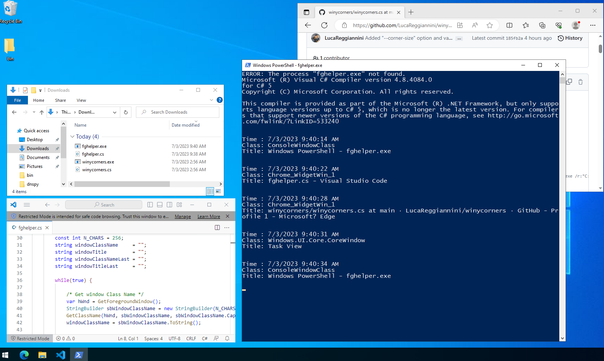

# WinYcorners
Sets a hot-corner that shows the Task View on mouse hover. 

This tool wants to imitate the hot corners of Gnome Desktop 40+.\
Gnome like hot corners for Windows.

# How to compile
I use *csc.exe* (i like it).

Locate your C# compiler with `cd C:/ %% dir /S /B csc.exe`\
Mine is in *C:\Windows\Microsoft.NET\Framework64\v4.0.30319\csc.exe*

Locate your *WindowsBase.dll* with `cd C:/ %% dir /S /B WindowsBase.dll`\
Mine is in *C:\Windows\Microsoft.NET\Framework64\v4.0.30319\WPF\WindowsBase.dll*

Now you are ready to compile:
```
git clone https://github.com/LucaReggiannini/winycorners.git
cd winycorners
C:\Windows\Microsoft.NET\Framework64\v4.0.30319\csc.exe /r:"C:\Windows\Microsoft.NET\Framework64\v4.0.30319\WPF\WindowsBase.dll" /t:winexe /out:winycorners.exe winycorners.cs
```

# Usage
```
WinYcorners v1.5.0
https://github.com/LucaReggiannini/winycorners/

Sets a hot-corner that shows the Task View on mouse hover.

This tool wants to imitate the hot corners of Gnome Desktop 40+.

SYNOPSIS: 
    winycorners [OPTIONS] [POSITION]

OPTIONS:
    --enhanced-task-view
        Hides taskbar and maximize the desktop working area.
        Show the taskbar only when taskview is visible (like Gnome)

    --corner-size
        The size of the hot corner in pixels. Default value is 8px

POSITION:
    --top-left
    --top-right
    --bottom-left
    --bottom right

    default position is top-left
```

# Update: Fghelper
Fghelper is a small tool that logs basic information about the current foreground window.

It is useful to debug WinYcorners problems in case class or window names for desktop elements are changed in new versions of Windows.

The procedure to compile fghelper is the same as WinYcorners. Example:
```
C:\Windows\Microsoft.NET\Framework64\v4.0.30319\csc.exe /out:fghelper.exe fghelper.cs
```

You'll just need to start the tool and select the window of which you want to obtain the information. The information will be written to the terminal window. For example, to get the details of the Task View it will be enough to press the `Win+Tab` keys and the information will be shown in the output. Example:


